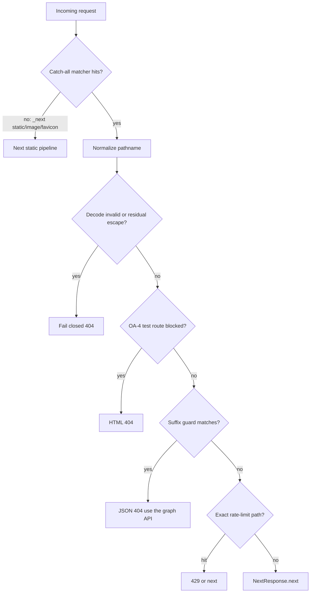

# Encoded Brain Map Static URLs - Plan

**Target repo:** ManintheCrowds/OpenGrimoire

Product Contract preservation: ce-plan-bootstrap (LFG from the OpenGrimoire pull-request list; no upstream unified plan).

## Goal Capsule

| Field | Value |
| --- | --- |
| Objective | Close encoded Brain Map static graph URLs with the same 404 class as the canonical files. Decoded API, rate-limit, and OA-4 behavior stay the same. Encoded spellings that skipped the old matcher are gated on purpose. |
| Authority | Product behavior: R-IDs. Mechanism: KTDs. Units cite those IDs and do not restate them. |
| Execution profile | Work only in this repo. Branch from `master`, not `feat/decision-graph-adapt`. Prefer completing the existing draft PR for this leak over a duplicate branch. |
| Stop | Do not merge the other listed OpenGrimoire PRs in this run. Do not bump Next.js. Do not add a root `middleware.ts`. Do not move graph JSON out of `public/` in this slice. Do not invent exploit payloads beyond the three encoded URL classes already named in the draft PR. |
| Tail ownership | After this plan is implementation-ready, the LFG caller owns `ce-work` through ship in this repo. |

---

## Product Contract

### Summary

OpenGrimoire already 404s decoded `/brain-map-graph.json` and `.local.json` (and `.json.*` backups) in `src/middleware.ts`.
Percent-encoded variants skip a narrow matcher and are served from `public/`, so a secret-gated graph can leak without `x-brain-map-key` or an operator session.
This plan ships that gate fix.
The rest of the pasted PR list stays out of this slice.

### Problem Frame

Middleware never runs for encoded filenames, and the guard regex compares an encoded pathname to a decoded pattern.
Next.js 14 static serving still maps those URLs onto files in `public/`.
That is a validate-before-canonicalize failure, not the CVE-2025-29927 header bypass.

### Requirements

- R1. Encoded equivalents of the blocked Brain Map static files return the same middleware 404 JSON as the decoded canonical paths.
- R2. `GET /api/brain-map/graph` and `GET /api/brain-map/meta` stay reachable and keep existing header-or-session auth.
- R3. Rate limits on survey submit, login, operator-probe ingest, and discovery GETs apply to the normalized path. Encoded spellings that previously skipped the narrow matcher must hit the same gates.
- R4. Production 404s OA-4 `/test*` routes unless `OPENGRIMOIRE_ALLOW_TEST_ROUTES` is set. Encoded `/test` prefixes that previously skipped the matcher must be gated too.
- R5. Invalid percent-sequences or leftover `%`+hex after the decode cap must not call `next()`. Use a generic 404 unless the path successfully normalizes and matches the Brain Map suffix guard, in which case use the existing API-only JSON 404.
- R6. This run does not land the other open PRs from the operator's list.
- R7. Well-formed non-graph `public/` assets that succeed today still succeed after catch-all when decode is clean.

### Actors

- A1. Anonymous visitor — must not read graph JSON from static URLs.
- A2. Operator with session — graph via API only; cookies do not unlock `public/` files.
- A3. Agent/client — `GET /api/brain-map/graph` with optional `x-brain-map-key`.

### Key Flows

- F1. Encoded static graph URL → middleware runs → normalize → block → 404 JSON pointing at the API.
- F2. Authorized `GET /api/brain-map/graph` and `/meta` stay 200, 401, or route 404 — never the static denylist JSON.
- F3. Unauthorized API fetch with secret set → 401 unchanged.

### Acceptance Examples

- AE1. Covers R1. `GET /%62rain-map-graph.json`, `GET /brain-map-graph%2Ejson`, and `GET /%2Fbrain-map-graph.json` return the middleware 404 JSON, not the file body.
- AE2. Covers R1. Encoded `.local.json` and encoded `.json.bak`-style suffixes that already match the suffix guard also 404.
- AE3. Covers R2. `GET /api/brain-map/graph` still returns 200 or 401 per `authorizeBrainMapRequest`, never the static 404 body.
- AE4. Covers R3. Encoded spellings of survey POST, login POST, ingest POST, and one discovery GET hit the same limiter contract as the decoded paths.
- AE5. Covers R5. A path with a broken `%` sequence or residual escape after the cap returns 404, does not `next()`, and the body is not graph JSON. Generic 404 unless the suffix guard matched after a successful normalize.
- AE6. Covers R1. Duplicate-slash forms of the blocked basename 404 in the same class as AE1.
- AE7. Covers R7. A known well-formed non-graph file under `public/` still succeeds when decode is clean.

### Success Criteria

Canonical and encoded Brain Map static URLs 404 with the existing API-only error body; the body is never the graph file.
Decoded API auth still matches today. Encoded rate-limit and OA-4 paths that skipped the old matcher are now gated (intentional hardening).
Fail-closed encodings never fall through to static serve.
This slice does not close CVE-2025-29927; a middleware-skip request can still reach `public/` until PR 51.
`npm run verify` passes. Matcher shape is proven by the location/source test; handler behavior by Vitest. One running-app AE1 body check is required before ship.

### Scope Boundaries

In scope: pathname normalize, Brain Map static-path guard, `src/middleware.ts` matcher and checks, colocated Vitest, a short security-doc sentence.

Out of scope: completing decision-chain PR 55, Turnstile, viz v2 rows, duplicate-email reject, CVE-2025-29927 (`x-middleware-subrequest`, PR 51) Next bump, harness sibling-escape, moderation-notes PATCH, WAL backup drafts, PR 20 root middleware, relocating graph JSON off `public/`.

#### Deferred to Follow-Up Work

Move graph artifacts out of `public/` so static serving cannot be a leak path.
Land PR 51 (CVE-2025-29927, `x-middleware-subrequest`, Next 14.2.x) as its own change; re-run the encoded URL suite after that bump.
Case-fold matcher policy if a real mixed-case static leak shows up on Windows.
Expand backup blocking beyond `.json.` suffixes (`~`, `_bak`) only if operators actually leave those names in `public/`.

---

## Planning Contract

### Assumptions

Pipeline defaults (no user confirmation this run):

- The pasted PR list is backlog context. This LFG slice ships the newest unique leak (encoded static graph URLs), not a merge of all sixteen PRs.
- Local `feat/decision-graph-adapt` is unrelated and must not receive these commits.
- Existing draft PR 56 is the preferred vehicle only if it already has catch-all matcher, shared normalize, global fail-closed, and no root middleware. If any item is missing, recreate from `master` and do not extend the old branch.
- Keeping files in `public/` plus a middleware denylist is acceptable for this slice; relocation is follow-up, not a blocker.
- Catch-all matcher (minus Next static/image/favicon) is required on 14.0.4 because the matcher is not encoding-aware; handler normalize never runs on a miss. Early `next()` after a clean normalize keeps the extra invocations I/O-free. Graph and discovery traffic now always pay that cost.
- Fail-closed is global under catch-all: bad encodings never `next()`, even on non-graph URLs.
- Framework dual-match of encoded matcher paths is Next 15.3.2+, so an app-level normalize on 14.0.4 is required.

### Key Technical Decisions

- KTD1. Normalize the pathname to a stable decoded form, then match. Governs R1, R3, R4, R5. Matching the raw URI then letting `public/` decode is the current bypass. Rejected: matcher-only dual regex on 14.x (Next does not dual-match encodings until 15.3.2).
- KTD2. Widen `config.matcher` to a catch-all that still excludes `_next/static`, `_next/image`, and `favicon.ico`. Governs R1. On 14.0.4 the matcher is not encoding-aware, so a filename pattern never invokes the handler. Rejected: adding more encoded literals (incomplete). Rejected: excluding `.*\\..*` (skips extensioned `public/` files including the JSON to gate). After catch-all, test-route prefixes are handler-only SSOT; they need not be duplicated in the matcher.
- KTD3. Run normalize once at the top of middleware and reuse that path for test-route, Brain Map, and rate-limit checks. Governs R3, R4. This also closes encoded matcher bypasses on those gates, which is intentional hardening, not mere preservation.
- KTD4. Fail closed when decode throws or residual `%HH` still looks like an escape after the pass limit: never `next()`. Governs R5. Generic 404 unless the suffix guard matched after a successful normalize. Rejected: using the original path on decode failure. Rejected: Brain Map JSON body on every bad encoding.
- KTD5. Keep graph JSON in `public/` this slice as a compensating denylist, not defense in depth. Governs scope. Static HTTP has no second control while files remain on the static root. Relocation stays follow-up. Rejected: bundling a public-dir move into this PR.
- KTD6. Do not bump `next` here. Governs R6 and Stop. 14.2.35 does not fix matcher encoding. CVE-2025-29927 (`x-middleware-subrequest`, PR 51) remains a separate leak: this denylist only runs when middleware executes.

### High-Level Technical Design

### Implementation Constraints

- Middleware lives only at `src/middleware.ts`. Location tests forbid a root file. PR 20's root `middleware.ts` must not be revived.
- Guard regex stays suffix-based (`/brain-map-graph(.local)?.json` plus `.json.` backups). Do not shrink it to exact names.
- Do not put security logic only in the matcher regex.
- Handler must stay cheap: normalize, a few string checks, then `next()` only after a successful normalize that is not blocked.
- After catch-all, do not require every OA-4 prefix in `config.matcher`. Prefix list in the handler remains SSOT. Rewrite `src/middleware.location.test.ts` from filename matcher strings to catch-all plus exclusions.

### Sequencing

U1 (normalize helper) before U2 (guard) before U3 (middleware). U4 docs after behavior is covered by tests.

---

## Implementation Units

### U1. Pathname normalize helper

**Goal:** One helper that canonicalizes request pathnames before any deny/allow decision.

**Requirements:** R1, R5

**Dependencies:** none

**Files:** `src/lib/http/normalize-request-pathname.ts` (create), `src/lib/http/normalize-request-pathname.test.ts` (create)

**Approach:**

1. Repeatedly percent-decode until stable or a small pass cap, collapse backslashes to slashes, collapse duplicate slashes, then resolve `.` and `..` segments. Fail closed if `..` would escape the URL root.
2. On `decodeURIComponent` throw or leftover `%`+hex after the cap, return a fail-closed signal. Do not return the original encoded string. Middleware treats that signal as generic 404 and never `next()`. The Brain Map guard must not run on fail-closed input and must not emit the API-only JSON body for it.
3. Follow existing `src/lib/` kebab-case helper style.

**Execution note:** Add failing tests for the three encoded URL classes and a broken `%` sequence before the helper exists, or immediately with the helper if the draft PR already has them.

**Patterns to follow:** `src/lib/brain-map/static-path-guard.ts` colocated tests; wiki/harness containment comments that reject `..` are a cousin pattern, not a copy.

**Test scenarios:**

- Happy path: decoded `/brain-map-graph.json` is unchanged besides slash collapse.
- Edge: `%62` on the first letter, `%2E`/`%2e` for the dot, and `%2F` producing a leading-slash form all normalize to a string the suffix guard can match.
- Edge: double-encoded forms either stabilize to the blocked name or fail closed.
- Edge: `.` and `..` segments resolve; `..` that would escape the URL root fail-closes.
- Error: invalid `%` sequence fails closed rather than throwing out of middleware.
- Error: leftover `%HH` after the pass cap fails closed.

**Verification:** Colocated Vitest for the helper is green. No graph file body is implied by a fail-closed result.

### U2. Guard uses normalized paths

**Goal:** `isBlockedBrainMapStaticPath` cannot be skipped by encoding.

**Requirements:** R1, AE1, AE2

**Dependencies:** U1

**Files:** `src/lib/brain-map/static-path-guard.ts`, `src/lib/brain-map/static-path-guard.test.ts`

**Approach:**

1. If the helper fail-closed, do not treat that as a Brain Map suffix hit. Return not-blocked so callers cannot emit the API-only JSON 404.
2. On a successful normalize, keep the existing suffix regex; do not replace it with an exact-name list.
3. Add encoded cases next to current decoded positives/negatives.

**Patterns to follow:** Existing comments in `static-path-guard.ts` about `.bak` / `.pre_e2e_backup`.

**Test scenarios:**

- Happy path: decoded canonical and `.local.json` still block.
- Happy path: decoded `.json.bak` still blocks.
- Edge: the three AE1 encodings block.
- Edge: encoded `.local.json` blocks.
- Negative: `/api/brain-map/graph` still does not block.

**Verification:** Guard unit tests cover decoded and encoded positives and the API negative.

### U3. Middleware catch-all and shared normalize

**Goal:** Encoded static graph URLs enter middleware and 404; other gates keep working on the normalized path.

**Requirements:** R1–R5, R7, AE1–AE7

**Dependencies:** U1, U2

**Files:** `src/middleware.ts`, `src/middleware.brain-map-static.test.ts` (create), `src/middleware.location.test.ts`, `e2e/test-routes.spec.ts` (comment or matcher list only if it documents prefixes)

**Approach:**

1. Catch-all matcher excluding Next static, image, and favicon only. Rewrite location tests and matcher-sync comments in `src/middleware.ts` and `e2e/test-routes.spec.ts`.
2. Apply U1 first. Fail-closed never `next()` and never calls the Brain Map JSON 404. On success, feed the normalized pathname to test-route, Brain Map, and rate-limit branches.
3. Keep JSON 404 body only for suffix-guard hits. Generic 404 for fail-closed encodings.
4. Vitest proves handler behavior. Location/source tests prove matcher shape. Vitest does not execute Next's matcher or `public/` order.
5. Record one running-app AE1 check (dev server or equivalent) that the response body is not graph JSON. That check is a ship gate, not optional residual.
6. Confirm normalized `/api/brain-map/graph` and `/api/brain-map/meta` `next()` into the route. Response must be auth 200/401/route 404, never the static denylist JSON.
7. Before ship, list `public/brain-map*` names. Anything outside the suffix guard is removed, renamed into the guarded pattern, or recorded as residual in the PR.

**Execution note:** Prefer invoking `middleware()` with `NextRequest` in Vitest like other `src/middleware.*.test.ts` files. Do not rely on live `curl` as the only proof.

**Patterns to follow:** Current rate-limit and OA-4 blocks in `src/middleware.ts`; location test that requires `src/middleware.ts` and forbids a root file.

**Test scenarios:**

- Happy path: decoded `/brain-map-graph.json` still 404 JSON.
- Integration: AE1 encoded URLs 404 JSON; body is not graph JSON.
- Integration: AE2 encoded `.local.json` and encoded `.json.bak`-style at middleware, not only the guard unit.
- Integration: Covers AE6. Duplicate-slash blocked basename 404s.
- Integration: `GET /api/brain-map/graph` and `GET /api/brain-map/meta` never return the static denylist JSON.
- Integration: Covers AE4. Encoded survey, login, ingest, and one discovery path still eligible for the same limiter contract.
- Integration: Covers AE5. Broken `%` / residual-after-cap → 404, not `next()`, body ≠ graph JSON.
- Integration: Covers AE7. One well-formed non-graph `public/` path still `next()`s on clean decode.
- Edge: encoded `/test` in a production-like env still hits OA-4 HTML 404 when test routes are disallowed.
- Negative: matcher source is catch-all plus `_next/static`, `_next/image`, `favicon.ico` exclusions — not filename patterns.
- Negative: location test still forbids root `middleware.ts`.

**Verification:** Middleware Vitest and location test pass. Survey/login/discovery predicates still key off exact normalized paths.

### U4. Security doc sentence

**Goal:** Operators know encoded static URLs are in the same 404 class as the canonical files.

**Requirements:** R1

**Dependencies:** U3

**Files:** `docs/security/NEXT_PUBLIC_AND_SECRETS.md`

**Approach:** One sentence that encoded path variants of the graph files are blocked after normalize, that clients still use the API, and that files remaining under `public/` are a residual until relocation. Do not add exploit walkthroughs.

**Test expectation:** none -- documentation only; behavior is proven in U1–U3.

**Verification:** The Brain Map static-file section mentions encoding and residual `public/` exposure, not only literal filenames.

---

## Verification Contract

Repo gate: `npm run verify` (lint, type-check, Vitest, capability/openapi/route-index, auth purity).

Behavior proof for this plan: the U1–U3 test files listed above, including AE1–AE7, plus one recorded running-app AE1 body check against a running Next server.
Do not treat Vitest `middleware(NextRequest)` as the only proof of Next matcher or `public/` serve order.
Do not treat a Next.js version bump as verification of this leak.

---

## Definition of Done

- Encoded and decoded Brain Map static URLs 404; body is never the graph file.
- Graph API auth behavior is unchanged on decoded paths; those routes `next()` through middleware.
- Encoded rate-limit and OA-4 paths are gated.
- Fail-closed encodings never `next()`.
- One running-app AE1 body check recorded.
- `public/brain-map*` inventory done; unguarded names handled or residual-noted.
- No root `middleware.ts`, no Next bump, no commits on `feat/decision-graph-adapt`.
- Other listed PRs remain unmerged by this run.
- Abandoned experiments are not left in the diff.
- `npm run verify` is green.

Per unit: U1 helper tests; U2 guard tests; U3 middleware/location tests; U4 doc sentence.

---

## System-Wide Impact

Catch-all matcher runs this middleware on almost every request, including `/api/*` and most `public/` files.
`GET /api/brain-map/graph` and `/meta` newly enter middleware every time; they must `next()` into route auth, never the static denylist JSON.
Fail-closed invalid encoding is site-wide, not brain-map-only.
OA-4 and rate-limit encoded matcher bypasses close as a side effect of KTD2+KTD3.
OA-4 maintainer contract: prefix list + normalize + e2e, not matcher enumeration.
Agent clients in `docs/AGENT_INTEGRATION.md` keep using the API; no new agent tool.

---

## Risks & Dependencies

| Risk | Mitigation |
| --- | --- |
| Catch-all extra invocations | Handler stays branch-and-return; no I/O after a clean normalize. |
| Fail-closed `next()` fall-through | R5/KTD4: never `next()`; U3 Covers AE5. |
| Fail-closed 404s unrelated URLs | Global by design; generic 404; AE7 protects clean static assets. |
| Decode asymmetry vs `public/` mapper | Residual until relocation; fail closed on ambiguous decode; assert body is not graph JSON. |
| Rate-limit / OA-4 hit surface grows | Intended (R3, R4); AE4 and encoded `/test` scenarios. |
| Location test still expects filename matchers | U3 rewrites that contract. |
| Vitest does not run Next matcher or static order | Location test for matcher source; running-app AE1 body check is a ship gate. |
| Graph JSON remains in `public/` | Accepted residual: compensating denylist; inventory `public/brain-map*`; relocation follow-up. Encoding fix does not close CVE-2025-29927. |
| Duplicate PR vs draft 56 | Prefer that branch; do not open a second fix for the same files. |
| Mixing decision-graph work | Branch from `master` only. |

Depends on Next.js 14.0.4 App Router middleware loading `src/middleware.ts`.

---

## Sources & Research

- `src/middleware.ts`, `src/lib/brain-map/static-path-guard.ts`, `src/app/api/brain-map/graph/route.ts`, `src/lib/brain-map/request-auth.ts`
- `docs/security/NEXT_PUBLIC_AND_SECRETS.md`, `docs/AGENT_INTEGRATION.md`
- Draft PR 56 body and file list (encoded leak on 14.0.4; not CVE-2025-29927)
- Next.js 14 middleware matcher docs; Next PR 78325 / 15.3.2 encoded matcher (not in 14.2.x)
- CWE-180 / CWE-174: canonicalize before validate; do not check between decode passes
